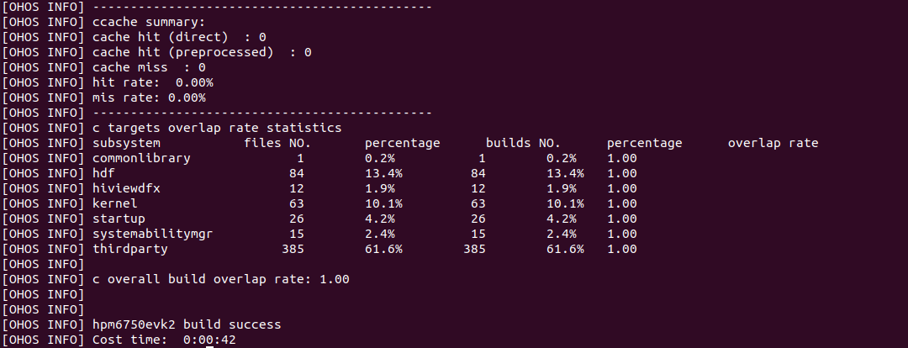

# device_soc_hpmicro

## 简介

本仓库为先楫半导体公司的HPM6700系列芯片相关代码仓库，用于存放与SoC芯片相关的SDK及适配代码。
使用同一系列SoC，开发不同的device或board时，可共用该仓库代码进行开发。

### hpm6700功能概述


HPM6700/6400 系列 MCU 是来自上海先楫半导体科技有限公司的高性能实时 RISC-V 微控制器，为工业自动化及边缘计算应用提供了极大的算力、高效的控制能力及丰富的多媒体功能。

**性能**

- RISC-V 内核支持双精度浮点运算及强大的 DSP 扩展，主频高达 816 MHz，创下了高达 9220 CoreMarkT M 和高达 4651 DMIPS 的 MCU 性能新记录。
- 32KB 高速缓存 (I/D Cache) 和高达 512KB 的零等待指令和数据本地存储器 (ILM / DLM)，加上 1MB 内置SRAM，极大避免了低速外部存储器引发的性能损失。

**外扩存储**

- 2 个串行总线控制器，支持 NOR Flash / HyperFlash / PSRAM / HyperRAM，支持 NOR Flash 在线加密执行，提供扩展性和兼容性极高的程序空间。
- SDRAM 控制器，支持 166MHz 的 16/32 位SDRAM/LPSDR。
- 2 个 SD/eMMC 控制器，可用于同时连接 WiFi 模块及大容量存储。

**多媒体**

- LCD 显示控制器，支持高达 1366×768 60 fps 显示。
- 图形加速器，支持图形缩放、叠加、旋转等硬件加速。
- JPEG 硬件编解码器。
- 双目摄像头，提高 AI 图像识别能力。
- 4 个 8 通道全双工 I2S 和 1 个数字音频输出。
- 多路语音和数字麦克风接口，便于实现高性能的语音识别应用。

**丰富外设**

- 多种通讯接口：两个千兆实时以太网，支持 IEEE1588，两个内置 PHY 的高速 USB，多达四路 CAN/CAN-FD 及丰富的 UART，SPI，I2C 等外设。
- 4 组共 32 路精度达 2.5ns 的 PWM。 
- 3 个 12 位高速 ADC 5MSPS，1 个 16 位高精度 ADC 2MSPS，4 个模拟比较器，多达 28 个模拟输入通道。
- 多达 36 路 32 位定时器，5 个看门狗和 RTC。

**安全**

- 集成 AES-128/256, SHA-1/256 加速引擎和硬件密钥管理器。支持固件软件签名认证、加密启动和加密执行，可防止非法的代码替换、篡改或复制。
- 基于芯片生命周期的安全管理，以及多种攻击的检测，进一步保护敏感信息。
- 内建 Boot ROM，可以通过 USB 或者 UART 对固件安全下载和升级。

**电源系统**
- 集成高效率 DCDC 转换器和 LDO, 支持系统单电源供电，可动态调节输出电压实现性能-功耗平衡，兼顾了电源的灵活性，易用性和效率。
- 多电源域设计，灵活支持各种低功耗模式。

*更多信息可以访问*[*先楫半导体官方网站*](http://www.hpmicro.com/)


## 开发环境

### 推荐采用Windows+Ubuntu环境进行开发：

-   Windows环境用于编写代码、下载程序和烧入固件等，系统要求：Windows 10 64位系统。

-   Linux环境用于代码下载、编译工程和生成固件等，系统要求：Ubuntu 20.04 64位及以上版本。

    - 若不确定所使用的Linux设备的系统及版本，请在bash中运行如下命令查看：

    ```bash
    lsb_release -a
    ```

    - 请在确认Linux系统不低于`Ubuntu 20.04.XX LTS`的情况下执行后续的步骤；否则，请升级或更换合适的Liunx设备。

> 若需要支持在Linux与Windows之间的文件共享以及编辑，请在Linux设备上适当地安装和配置samba、vim等常用软件。

### OpenHarmony开发环境搭建

[环境搭建](https://gitee.com/openharmony/docs/blob/HEAD/zh-cn/device-dev/quick-start/quickstart-lite-env-setup.md)

### 编译工具安装

[编译器安装:gcc_riscv32](https://gitee.com/openharmony/docs/blob/HEAD/zh-cn/device-dev/quick-start/quickstart-lite-steps-hi3861-setting.md#section34435451256) 或者直接下载 [可直接下载](https://repo.huaweicloud.com/harmonyos/compiler/gcc_riscv32/7.3.0/linux/gcc_riscv32-linux-7.3.0.tar.gz)


**设置环境变量**

说明： 如果直接采用编译好的riscv32 gcc包，请先执行以下命令将压缩包解压到用户的home(也可以是其他目录，注意使用实际的PATH即可)：

```bash
tar -xvf gcc_riscv32-linux-7.3.0.tar.gz -C ~
```

将以下命令拷贝到`.bashrc`文件的最后一行，保存并退出。

```bash
export PATH=~/gcc_riscv32/bin:$PATH
```

执行下面命令使环境变量生效:

```bash
source ~/.bashrc
```
Shell命令行中输入如下命令`riscv32-unknown-elf-gcc -v`，如果能正确显示编译器版本号，表明编译器安装成功。

```bash
Using built-in specs.
COLLECT_GCC=riscv32-unknown-elf-gcc
COLLECT_LTO_WRAPPER=/home/hhp/ohos/tools/gcc_riscv32/bin/../libexec/gcc/riscv32-unknown-elf/7.3.0/lto-wrapper
Target: riscv32-unknown-elf
Configured with: ../riscv-gcc/configure --prefix=/home/yuanwenhong/gcc_compiler_riscv/gcc_riscv32/gcc_riscv32 --target=riscv32-unknown-elf --with-arch=rv32imc --with-abi=ilp32 --disable-__cxa_atexit --disable-libgomp --disable-libmudflap --enable-libssp --disable-libstdcxx-pch --disable-nls --disable-shared --disable-threads --disable-multilib --enable-poison-system-directories --enable-languages=c,c++ --with-gnu-as --with-gnu-ld --with-newlib --with-system-zlib CFLAGS='-fstack-protector-strong -O2 -D_FORTIFY_SOURCE=2 -Wl,-z,relro,-z,now,-z,noexecstack -fPIE' CXXFLAGS='-fstack-protector-strong -O2 -D_FORTIFY_SOURCE=2 -Wl,-z,relro,-z,now,-z,noexecstack -fPIE' LDFLAGS=-Wl,-z,relro,-z,now,-z,noexecstack 'CXXFLAGS_FOR_TARGET=-Os -mcmodel=medlow -Wall -fstack-protector-strong -Wl,-z,relro,-z,now,-z,noexecstack -Wtrampolines -fno-short-enums -fno-short-wchar' 'CFLAGS_FOR_TARGET=-Os -mcmodel=medlow -Wall -fstack-protector-strong -Wl,-z,relro,-z,now,-z,noexecstack -Wtrampolines -fno-short-enums -fno-short-wchar' --with-headers=/home/yuanwenhong/gcc_compiler_riscv/gcc_riscv32/gcc-riscv32/riscv32-unknown-elf/include --with-mpc=/usr/local/mpc-1.1.0 --with-gmp=/usr/local/gmp-6.1.2 --with-mpfr=/usr/local/mpfr-4.0.2
Thread model: single
gcc version 7.3.0 (GCC)
```


### 源码获取

#### 参考如下链接获取OpenHarmony源码

[代码获取](https://gitee.com/openharmony/docs/blob/HEAD/zh-cn/device-dev/get-code/sourcecode-acquire.md)

**注意:需要使用master分支或者[OpenHarmony v3.2 Beta3](https://gitee.com/openharmony/docs/blob/HEAD/zh-cn/release-notes/Readme.md)及以上版本**

#### 从sig获取先楫hpm6750适配源码

**soc仓获取**

在ohos源码树的`device/soc/`目录下执行如下命令：

```bash
git clone https://gitee.com/openharmony-sig/device_soc_hpmicro.git -b master hpmicro
```


**board仓获取**

在ohos源码树的`device/board/`目录下执行如下命令：

```bash
git clone https://gitee.com/openharmony-sig/device_board_hpmicro.git -b master hpmicro
```

**vendor仓获取**

在ohos源码树的`vendor/`目录下执行如下命令：

```bash
git clone https://gitee.com/openharmony-sig/vendor_hpmicro.git -b master hpmicro
```


## 工程编译

### 选择目标工程

执行`hb set`选择`hpmicro`下的`hpm6750evk2`:


### 编译工程

执行`hb build -f`进行工程编译，编译成功后显示如下内容：




### 打开xts功能

执行`hb build -f --gn-args="build_xts=true"`命令进行xts编译。

注意:编译xts需要需要打如下补丁，修改线程栈为1800，否则会出现栈溢出崩溃

```bash
diff --git a/distributed_schedule_lite/system_ability_manager_hal/src/taskpool_singletask_func_test.c b/distributed_schedule_lite/system_ability_manager_hal/src/taskpool_singletask_func_test.c
index 7fc006e18..dd66409e9 100755
--- a/distributed_schedule_lite/system_ability_manager_hal/src/taskpool_singletask_func_test.c
+++ b/distributed_schedule_lite/system_ability_manager_hal/src/taskpool_singletask_func_test.c
@@ -201,7 +201,7 @@ static TaskConfig GetTaskConfig(Service *service)
     // queueSize: [0, system upper limit), 0: will not create taskpool, the max value depends on RAM size
     // priority: PRI_ABOVE_NORMAL PRI_NORMAL PRI_BELOW_NORMAL PRI_LOW
 
-    TaskConfig config = { LEVEL_HIGH, PRI_NORMAL, 1600, 2, SINGLE_TASK };
+    TaskConfig config = { LEVEL_HIGH, PRI_NORMAL, 1800, 2, SINGLE_TASK };
     if (service == (Service *)&g_service[INDEX0]) {
         config.priority = PRI_LOW;
     } else if (service == (Service *)&g_service[INDEX1]) {
@@ -571,4 +571,4 @@ LITE_TEST_CASE(SingleTaskFuncTestSuite, testSingleTask0050, Function | MediumTes
     }
 };
 
diff --git a/distributed_schedule_lite/system_ability_manager_hal/src/taskpool_specifiedtask_func_test.c b/distributed_schedule_lite/system_ability_manager_hal/src/taskpool_specifiedtask_func_test.c
index 734a22081..4b5b65562 100755
--- a/distributed_schedule_lite/system_ability_manager_hal/src/taskpool_specifiedtask_func_test.c
+++ b/distributed_schedule_lite/system_ability_manager_hal/src/taskpool_specifiedtask_func_test.c
@@ -148,7 +148,7 @@ static BOOL MessageHandle(Service *service, Request *msg)
 static TaskConfig GetTaskConfig(Service *service)
 {
     (void)service;
-    TaskConfig config = {LEVEL_HIGH, PRI_NORMAL, 1600, 20, SPECIFIED_TASK};
+    TaskConfig config = {LEVEL_HIGH, PRI_NORMAL, 1800, 20, SPECIFIED_TASK};
     return config;
 }
 
@@ -400,4 +400,4 @@ LITE_TEST_CASE(SpecifiedTaskFuncTestSuite, testSpecifiedTask0030, Function | Med
     osDelay(OPER_INTERVAL);
     TEST_ASSERT_EQUAL_INT(g_servicePoint1 == g_servicePoint2, TRUE);
 };

```

## 镜像烧录

### 下载安装烧录工具(windows)

点击[HPMProgrammmer_v0.2.0](https://gitee.com/huohongpeng/hpmprogrammmer/releases/download/v0.2.0/HPMProgrammmer_v0.2.0.zip)下载

下载后解压HPMProgrammmer_v0.2.0.zip文件到任意目录。

找到`HPMProgrammer.exe`，双击执行程序：


### 下载程序到开发板

1. 将开发板的`USB2UART0`接口连接至PC，正确连接后，PC可识别到一路usb串口，hpm6750evk2板载了ch340 usb转串口芯片。

2. 将BOOT拨码开关设置为:

boot0: 0

boot1: 1

拨码开关设置好后，点击开发板的`RESTN`按钮，进行复位，复位后进入到isp模式。

3. HPMProgrammer的`Port Configuration`选择步骤1识别到的串口，点击`Attach`按钮，在ISP模式下可识别到开发板：


4. 拷贝编译好的固件程序`out/hpm6750evk/hpm6750evk2/OHOS_Image.bin`到windows。

5. 点击`Open File`选择固件程序，点击`Program`进行下载:


6. 设置拨码开关为正常模式

boot0: 0

boot1: 0

7. 打开一个串口终端，重启开发板，串口打印启动信息


## 相关仓库

[vendor_hpmicro](https://gitee.com/openharmony-sig/vendor_hpmicro)

[device_soc_hpmicro](https://gitee.com/openharmony-sig/device_soc_hpmicro)

[device_board_hpmicro](https://gitee.com/openharmony-sig/device_board_hpmicro)

## 联系

如果您在开发过程中有问题，请在仓库[issues](https://gitee.com/openharmony-sig/device_soc_hpmicro/issues)提问。


